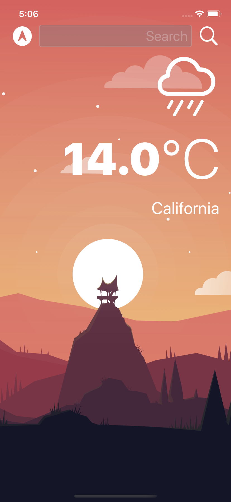
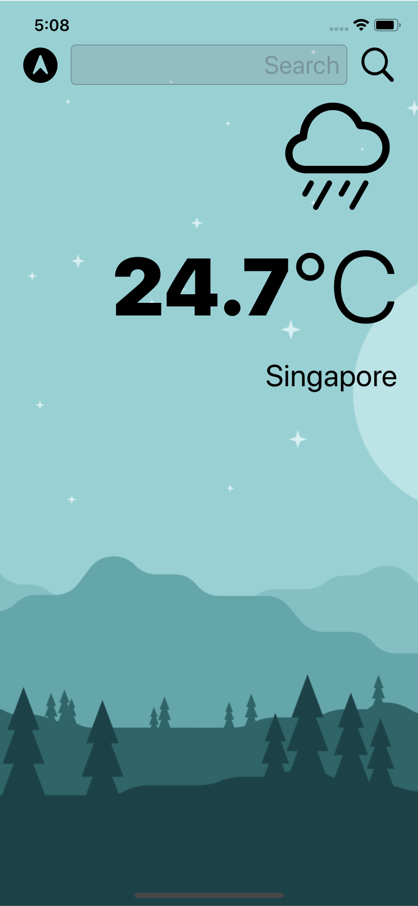

#  Clima

A beautiful, dark-mode enabled weather app. Users will be able to check the weather for the current location based on the GPS data from the iPhone, as well as by searching for a city manually.

Note: The API key has been excluded from the file to prevent misuse. Please visit https://openweathermap.org to request an API key - it's free :D

## Screenshots

     

## What I have learned

* How to create a dark-mode enabled app.
* How to use vector images as image assets.
* Learn to use the UITextField to get user input. 
* Learn about the delegate pattern.
* Swift protocols and extensions. 
* Swift guard keyword. 
* Swift computed properties.
* Swift closures and completion handlers.
* Learn to use URLSession to network and make HTTP requests.
* Parse JSON with the native Encodable and Decodable protocols. 
* Learn to use Grand Central Dispatch to fetch the main thread.
* Learn to use Core Location to get the current location from the phone GPS. 

## Credits

>This is a companion project to The App Brewery's Complete App Development Bootcamp, full course at [www.appbrewery.co](https://www.appbrewery.co/)

